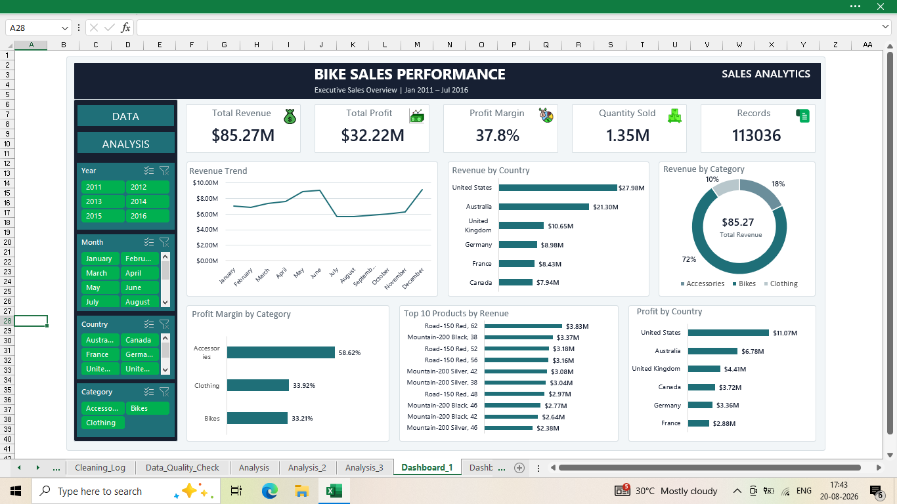
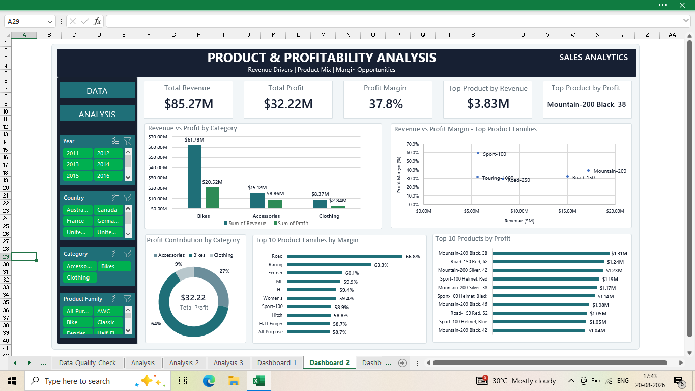
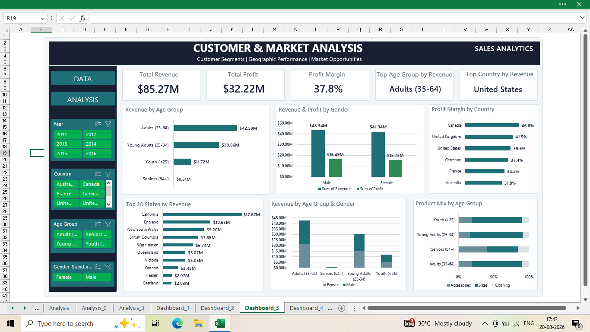
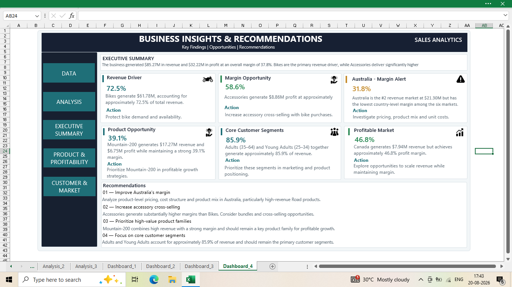

# Bike Sales Analysis Dashboard

## Project Overview

This project is an end-to-end Excel Data Analyst portfolio project that analyzes bike sales data to identify trends in revenue, profit, products, customers, and geographic markets.

The project includes data cleaning, data quality checks, PivotTables, PivotCharts, interactive dashboards, and business recommendations.

---

## Business Objective

The objective of this project is to answer the following business questions:

- How is the overall sales and profit performance?
- Which countries generate the highest revenue and profit?
- Which product categories and products drive revenue?
- Which products and categories have the highest profit margins?
- Which customer segments contribute the most revenue?
- Which markets have high revenue but low profitability?
- What actions can the business take to improve profitable growth?

---

# 📅 Dataset Information

The dataset covers the period:

**January 2011 – July 2016**

### Important Date Coverage

| Year | Data Coverage |
|------|---------------|
| 2011 | Full Year |
| 2012 | Full Year |
| 2013 | Full Year |
| 2014 | January – July |
| 2015 | Full Year |
| 2016 | January – July |

> ⚠️ 2014 and 2016 contain partial-year data and should not be directly compared with full-year periods without considering this limitation.

---

# Data Cleaning & Quality Checks

The dataset was reviewed and validated before analysis.
The workbook includes a `Cleaning_Log` and `Data_Quality_Check` sheet.

The process included:

- Checking missing values
- Checking duplicate records
- Validating data types
- Checking minimum and maximum values
- Validating Revenue, Cost, and Profit
- Checking negative profit values
- Validating Profit Margin
- Checking date ranges
- Validating customer age
- Creating Age Groups
- Checking Country and State hierarchy
- Documenting data cleaning decisions

### Key formulas

**Profit = Revenue − Cost**

**Profit Margin = Profit ÷ Revenue**

For aggregated analysis, profit margin is calculated from aggregated Profit and Revenue rather than summing transaction-level percentages.

## Customer Segmentation
| Age Group | Definition |
|---|---|
| Youth | <25 |
| Young Adults | 25–34 |
| Adults | 35–64 |
| Seniors | 65+ |

## Dashboard 1 — Executive Sales Overview
### KPIs
- Revenue: **$85.27M**
- Profit: **$32.22M**
- Profit Margin: **37.8%**
- Order Quantity: **1.35M**
- Records: **113,036**

### Visuals
- Revenue by Country
- Monthly Revenue Performance
- Revenue by Category
- Profit Margin by Category
- Top 10 Products by Revenue
- Profit by Country

### Key finding
The United States is the largest revenue market and Bikes are the dominant revenue category.

## Dashboard 2 — Product & Profitability Analysis
### Visuals
- Revenue vs Profit by Category
- Revenue vs Profit Margin for selected top product families
- Profit Contribution by Category
- Top 10 Product Families by Margin
- Top 10 Products by Profit

### Key findings
- Bikes: **$61.78M revenue**, **$20.52M profit**, about **33.2% margin**
- Accessories: **$15.12M revenue**, **$8.86M profit**, about **58.6% margin**
- Clothing: **$8.37M revenue**, **$2.84M profit**, about **33.9% margin**
- Mountain-200: **$17.27M revenue**, **$6.75M profit**, about **39.1% margin**

## Dashboard 3 — Customer & Market Analysis
### Visuals
- Revenue by Age Group
- Revenue & Profit by Gender
- Profit Margin by Country
- Top 10 States by Revenue
- Revenue by Age Group & Gender
- Product Mix by Age Group

### Key findings
- Adults (35–64): **$42.58M revenue**
- Young Adults (25–34): **$30.66M revenue**
- Adults + Young Adults: approximately **85.9% of total revenue**
- United States: **$27.98M revenue**
- Australia: **$21.30M revenue**, approximately **31.8% margin**
- Canada: **$7.94M revenue**, approximately **46.8% margin**

## Dashboard 4 — Business Insights & Recommendations
### Major insights
**1. Bikes are the revenue driver**  
Bikes generate **$61.78M**, about **72.5% of revenue**. Protect bike demand and availability.

**2. Accessories are a margin opportunity**  
Accessories generate about **58.6% margin**. Consider bundles and cross-selling with bike purchases.

**3. Australia needs margin investigation**  
Australia is the #2 revenue market but has the lowest margin among the six countries. Investigate pricing, product mix and unit costs.

**4. Mountain-200 is a strong product opportunity**  
It combines high revenue with a strong margin. Prioritize it in profitable growth strategies.

**5. Adults and Young Adults are the core customer segments**  
Together they generate about **85.9% of revenue**. Prioritize these segments while exploring smaller segments.

**6. Canada is a profitable-growth opportunity**  
Canada has a strong margin of about **46.8%** despite lower revenue. Explore ways to scale while maintaining margin.

## Dashboard Color Palette
| Element | Color |
|---|---|
| Primary Navy | `#172033` |
| Primary Teal | `#1F6F78` |
| Positive Green | `#2E8B57` |
| Attention Amber | `#C58B2A` |
| Background | `#F2F6F8` |
| Card Background | `#FFFFFF` |
| Secondary Text | `#66737D` |
| Border | `#D9E1E5` |

## Analytical Notes

- Overall Profit Margin is calculated as **Total Profit ÷ Total Revenue**.
- **2014 and 2016 are partial years**, with data available from January through July.
- Top-N visuals are used to avoid overcrowding and improve dashboard readability.
- The **Revenue vs. Profit Margin scatter plot** focuses on selected high-revenue product families for better visualization.
- Profit Margin should not be calculated by summing individual percentage values. Aggregated margin is calculated using total profit and total revenue.

---

## Workbook Structure

The Excel workbook contains the following sheets:

- `raw_data` – Original dataset used for the project.
- `clean_data` – Cleaned and prepared dataset used for analysis.
- `Cleaning_Log` – Documentation of data cleaning steps and transformations.
- `Data_Quality_Check` – Validation checks performed to identify potential data quality issues.
- `Analysis` – Initial exploratory analysis using PivotTables.
- `Analysis_2` – Product and profitability analysis.
- `Analysis_3` – Customer and market analysis.
- `Dashboard_1` – Executive Sales Overview.
- `Dashboard_2` – Product and Profitability Analysis.
- `Dashboard_3` – Customer and Market Analysis.
- `Dashboard_4` – Key Insights and Business Recommendations.

## Dashboard Preview

Executive Sales Overview

Product & Profitability Analysis

Customer & Market Analysis

Business Insights & Recommendations

---

## Skills Demonstrated

This project demonstrates practical skills in:

- Data Cleaning and Preparation
- Data Quality Checks
- Data Validation
- Cleaning documentation
- Excel Tables
- PivotTables and PivotCharts
- Calculated Fields
- Profitability Analysis
- Customer Segmentation
- `IFS`
- `GETPIVOTDATA`
- Product Performance Analysis
- Profit and margin calculations
- Market Analysis
- Top-N analysis
- Geographic analysis
- Custom number formatting
- Trend Analysis
- KPI Development
- Interactive Dashboards
- Slicers and Filters
- Data Visualization
- Business Insights and Recommendations
- Data Storytelling

---

## Project Details

**Project Type:** Excel Data Analyst Portfolio Project

**Tools Used:** Microsoft Excel, PivotTables, PivotCharts, Slicers, Calculated Fields, Data Cleaning, Data Quality Checks, Data Analysis, and Dashboard Design.

Author

Imran Ansari

Aspiring Data Analyst | SQL | Excel | Power BI | Python